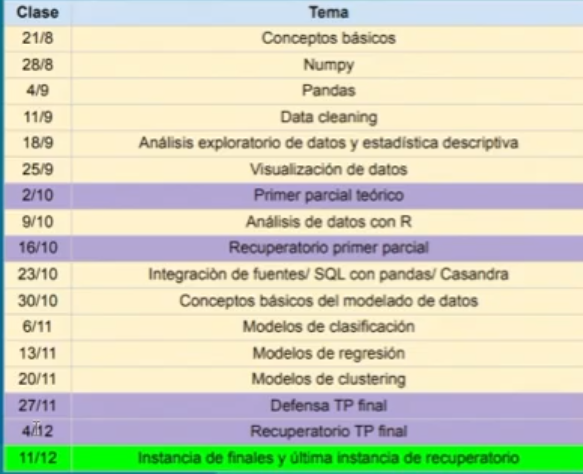

# <font color="#1F6FEB">Introducción al Análisis de Datos</font>

Apuntes de cursada y material de clase de la materia **Introducción al Análisis de Datos** (Tecnicatura Universitaria en Programación, UTN Facultad Regional Avellaneda). El objetivo del repositorio es centralizar lo que se va viendo en cada clase, dejar registro de los conceptos y consignas del profesor, y servir de referencia rápida para repasar antes de los parciales.

**Cursada:** 2do. cuatrimestre 2026 · **Profesor:** Fernández, Luis Nahuel

---

## <font color="#8250DF">🧭 Índice</font>

- [<font color="#8250DF"><strong>Funcionamiento de la materia</strong></font>](#funcionamiento)
  - [<font color="#1A7F37">Modalidad y criterios de evaluación</font>](#funcionamiento-modalidad)
  - [<font color="#1A7F37">Exámenes</font>](#funcionamiento-examenes)
  - [<font color="#1A7F37">Cronograma de clases</font>](#funcionamiento-cronograma)
  - [<font color="#1A7F37">Bibliografía</font>](#funcionamiento-bibliografia)
  - [<font color="#1A7F37">Herramientas</font>](#funcionamiento-herramientas)
- [<font color="#8250DF"><strong>Clase 1 — 21/8 · Conceptos fundamentales del análisis de datos</strong></font>](#clase-1)
  - [<font color="#1A7F37">Dato y tipos de datos</font>](#clase-1-dato)
  - [<font color="#1A7F37">¿De qué trata el análisis de datos?</font>](#clase-1-de-que-trata)
  - [<font color="#1A7F37">Data Mining y Big Data</font>](#clase-1-data-mining)
  - [<font color="#1A7F37">Análisis estadístico vs. Minería de datos</font>](#clase-1-vs-mineria)
  - [<font color="#1A7F37">Tipos de variables</font>](#clase-1-variables)
  - [<font color="#1A7F37">Clasificación del análisis según cantidad de variables</font>](#clase-1-clasificacion-analisis)
  - [<font color="#9A6700">Evolución tecnológica del lenguaje dominante</font>](#clase-1-evolucion-lenguajes)
  - [<font color="#1A7F37">Ley de los grandes números</font>](#clase-1-ley-grandes-numeros)
  - [<font color="#1A7F37">Teorema central del límite</font>](#clase-1-teorema-central-limite)
  - [<font color="#9A6700">Relación entre el TCL y el test de hipótesis</font>](#clase-1-tcl-test-hipotesis)
  - [<font color="#1A7F37">Notas de la clase</font>](#clase-1-notas)
- [<font color="#8250DF"><strong>Clase 2 — 28/8 · Numpy</strong></font>](#clase-2) *(pendiente)*
- [<font color="#9A6700"><strong>🟣 2/10 · Primer parcial teórico</strong></font>](#eval-2-10)
- [<font color="#8250DF"><strong>Clase 7 — 9/10 · Análisis de datos con R</strong></font>](#clase-7) *(pendiente)*
- [<font color="#9A6700"><strong>🟣 16/10 · Recuperatorio primer parcial</strong></font>](#eval-16-10)
- [<font color="#8250DF"><strong>Clase 8 — 23/10 · Integración de fuentes / SQL con pandas / Cassandra</strong></font>](#clase-8) *(pendiente)*
- [<font color="#8250DF"><strong>Clase 9 — 30/10 · Conceptos básicos del modelado de datos</strong></font>](#clase-9) *(pendiente)*
- [<font color="#8250DF"><strong>Clase 10 — 6/11 · Modelos de clasificación</strong></font>](#clase-10) *(pendiente)*
- [<font color="#8250DF"><strong>Clase 11 — 13/11 · Modelos de regresión</strong></font>](#clase-11) *(pendiente)*
- [<font color="#8250DF"><strong>Clase 12 — 20/11 · Modelos de clustering</strong></font>](#clase-12) *(pendiente)*
- [<font color="#9A6700"><strong>🟣 27/11 · Defensa TP final</strong></font>](#eval-27-11)
- [<font color="#9A6700"><strong>🟣 4/12 · Recuperatorio TP final</strong></font>](#eval-4-12)
- [<font color="#1A7F37"><strong>🟢 11/12 · Instancia de finales y última instancia de recuperatorio</strong></font>](#eval-11-12)

> *Nota: en el índice figuran las clases 3, 4, 5 y 6 con su fecha en el cronograma más abajo; se suman aquí a medida que tienen contenido desarrollado.*

---

## <a id="funcionamiento"></a><font color="#8250DF">🗓️ Funcionamiento de la materia</font>

[](https://docs.google.com/viewer?url=https://raw.githubusercontent.com/LautaroSantiago/Introduccion-Analisis-Datos-UTN/master/Material/0%20-%20Funcionamiento.pdf)

### <a id="funcionamiento-modalidad"></a><font color="#1A7F37">Modalidad y criterios de evaluación</font>

- **Modalidad:** clases con código en Python y R. Libre elección de lenguaje/IDE — **no se evalúa código**. El código visto en clase se comparte por Google Colab (hay que hacer copia propia para poder modificarlo).
- **Asistencia:** se exige 75% (máximo 3 faltas en el cuatrimestre).
- **Regularidad:** 4 o más en ambos parciales.
- **Aprobación:** 6 o más en ambos parciales, o final en caso de no lograrlo.

> **A tener en cuenta:** quienes no lleguen a regularizar (menos de 4 en algún parcial) pueden presentarse el 11/12 a un examen integrador para regularizar, con nota máxima 4.

### <a id="funcionamiento-examenes"></a><font color="#1A7F37">Exámenes</font>

| Instancia | Fecha | Detalle |
|---|---|---|
| Primer parcial | 2/10 | Teórico y virtual |
| Recuperatorio 1er parcial | 16/10 | — |
| Segundo parcial (TP final) | — | Informe utilizando las bases de la Encuesta Permanente de Hogares (INDEC) |
| Defensa TP final | 27/11 | — |
| Recuperatorio TP final | 4/12 | — |
| Finales / última instancia de recuperatorio | 11/12 | Examen integrador (nota máx. 4) para quienes no regularizaron |

### <a id="funcionamiento-cronograma"></a><font color="#1A7F37">Cronograma de clases</font>

Cada clase se despliega individualmente con su desarrollo completo adentro. Se va actualizando a medida que avanza la cursada — las que todavía no se dictaron dicen *"pendiente"*.

<details>
<summary><a id="clase-1"></a><font color="#1A7F37"><strong>Clase 1 — 21/8 · Conceptos fundamentales del análisis de datos</strong></font></summary>

[](https://docs.google.com/viewer?url=https://raw.githubusercontent.com/LautaroSantiago/Introduccion-Analisis-Datos-UTN/master/Material/1%20-%20Clase%201.pdf)

#### <a id="clase-1-dato"></a><font color="#1A7F37">Dato y tipos de datos</font>

**Dato:** representación de un hecho, una observación o una característica de un objeto, persona o evento, expresada mediante números, texto, fecha, símbolos o cualquier otro formato. Por sí solo, un dato carece de contexto y significado suficiente para tomar decisiones. *Ejemplos: 38.5, "Azul", 2026-08-04, 125, "Juan Pérez".*

**Tipos de datos según su estructura:**
- **Estructurados:** organizados en tablas (filas/columnas). Ej: bases de datos relacionales.
- **Semiestructurados:** XML, JSON, CSV, logs, APIs.
- **No estructurados:** texto libre, imágenes, audio, video, redes sociales.

#### <a id="clase-1-de-que-trata"></a><font color="#1A7F37">¿De qué trata el análisis de datos?</font>

Proceso de **recolección** (bases de datos, archivos, encuestas) → **limpieza** → **transformación** → **exploración y visualización** → **análisis e interpretación** → **conocimiento accionable** (toma de decisiones, resolución de problemas, respuestas a preguntas).

> **Definición (Wikipedia):** "El análisis de datos es un proceso que consiste en inspeccionar, limpiar y transformar datos con el objetivo de resaltar información útil, para sugerir conclusiones y apoyo en la toma de decisiones."

**Perspectiva académica:** una visión más ligada a la estadística reduce el análisis de datos a estadística descriptiva (analiza los datos disponibles) o inferencial (a partir de una muestra de un universo, genera predicciones/definiciones generales para ese universo). En la práctica actual, el analista de datos excede ese campo tradicional y recurre también al aprendizaje automático y la minería de datos.

#### <a id="clase-1-data-mining"></a><font color="#1A7F37">Data Mining y Big Data</font>

- La minería de datos (*data mining*) surge en el siglo XIX con el análisis de los datos sociales de Quetelet, biológicos de Galton y agronómicos de Fisher.
- Forma parte del proceso conocido como **KDD** (*Knowledge Discovery in Databases* — descubrimiento de conocimiento a partir de los datos): el objetivo es extraer información de una gran base de datos, sin disponer de conocimiento previo, para construir patrones y/o relaciones sistemáticas de valor, así como anomalías.
- **Big Data — las 5 "V":** Volumen, Velocidad y Variedad como las tres centrales; Veracidad y Valor como las dos adicionales a tener en cuenta.

#### <a id="clase-1-vs-mineria"></a><font color="#1A7F37">Análisis estadístico vs. Minería de datos</font>

| Análisis estadístico | Minería de datos |
|---|---|
| Procedimiento hipotético deductivo | Procedimiento inductivo |
| Técnicas confirmatorias | Técnicas exploratorias |
| Supuestos iniciales | Sin supuestos iniciales |
| Herramientas informáticas opcionales | Recursos informáticos indispensables |

#### <a id="clase-1-variables"></a><font color="#1A7F37">Tipos de variables</font>

- **Categóricas:** cualitativas, no se pueden ordenar.
- **Ordinales:** se pueden ordenar, pero no se puede establecer distancia entre valores.
- **Cuantitativas discretas:** numéricas; entre dos valores consecutivos no poseen valores intermedios.
- **Cuantitativas continuas:** numéricas; entre dos valores poseen infinitos valores intermedios.

#### <a id="clase-1-clasificacion-analisis"></a><font color="#1A7F37">Clasificación del análisis según cantidad de variables</font>

| Univariado | Bivariado o multivariado |
|---|---|
| Análisis de una sola variable a la vez. | Se analizan dos o más variables, a nivel de su relación, dependencia o patrones. |
| Medidas de tendencia central (media, mediana, moda) o de dispersión (varianza, rango) u otras (curtosis). | Ej: clusterización de clientes de una empresa, regresión entre edad y peso. |
| Ejemplo: media etaria del aula. | |

#### <a id="clase-1-evolucion-lenguajes"></a><font color="#9A6700">Evolución tecnológica del lenguaje dominante</font>

Históricamente **C** fue el lenguaje más usado. Con el tiempo, **R** creció fuerte hasta ubicarse en el top 10, siendo un lenguaje enfocado exclusivamente en análisis de datos, mientras C fue perdiendo terreno. En 2017 aparece el paper *"Attention Is All You Need"*, que impulsa la explosión de la inteligencia artificial. Desde entonces, **Python** asciende hasta convertirse en el lenguaje más usado, superando a R, por ser el lenguaje de la IA y del procesamiento de grandes volúmenes de datos.

#### <a id="clase-1-ley-grandes-numeros"></a><font color="#1A7F37">Ley de los grandes números</font>

Formulada originalmente por **Jacob Bernoulli** en el siglo XVII: la frecuencia relativa de un evento tiende a converger hacia su probabilidad teórica a medida que aumenta el número de ensayos. En el contexto de la estadística inferencial: a medida que crece el tamaño de una muestra tomada de una población, la media muestral tiende a aproximarse cada vez más al valor esperado (esperanza matemática) de la población.

- **Implicancia práctica:** no se pueden sacar conclusiones definitivas sobre fenómenos masivos a partir de casos aislados; hace falta una muestra representativa y lo suficientemente grande.
- **Vínculo con la IA:** el salto de capacidad entre modelos (ej. GPT-2 a GPT-3) se explica en gran parte por el volumen de datos de entrenamiento — es una cuestión de escala, no solo conceptual.

#### <a id="clase-1-teorema-central-limite"></a><font color="#1A7F37">Teorema central del límite</font>

Desarrollado originalmente entre los siglos XVIII y XIX, y reformulado hasta el siglo XX. Establece que, dada una población con cualquier distribución, la distribución de las medias muestrales tiende a una distribución normal a medida que aumenta el tamaño de la muestra, siempre que la varianza poblacional sea finita.

- Permite, conociendo las propiedades de la distribución normal, testear si una diferencia observada entre dos grupos (ej. rendimiento de dos semillas, una original y una modificada genéticamente) es significativa o no.

#### <a id="clase-1-tcl-test-hipotesis"></a><font color="#9A6700">Relación entre el TCL y el test de hipótesis</font>

*(Consigna del profesor para investigar.)*

El test de hipótesis necesita saber qué forma tiene la distribución de un estadístico (por ejemplo, la media muestral) para poder calcular probabilidades y decidir si un resultado es "raro" o no. El **Teorema Central del Límite** es lo que garantiza esa forma: dice que, sin importar cómo se distribuya la población original, la distribución de las medias muestrales se aproxima a una normal a medida que crece el tamaño de la muestra (n).

Eso es lo que habilita todo el mecanismo del test de hipótesis:

1. Se plantea una **hipótesis nula (H₀)** (ej: "las dos semillas rinden igual").
2. Gracias al TCL, se sabe que la media muestral sigue (aproximadamente) una distribución normal, con lo cual se puede calcular su desvío estándar (error estándar) y ubicar el resultado observado dentro de esa curva.
3. Se calcula qué tan probable es obtener la diferencia observada (o una más extrema) **si H₀ fuera cierta** — esto es el **p-valor**.
4. Si esa probabilidad es muy baja (por debajo de un umbral, típicamente 0.05), se **rechaza H₀**: la diferencia es estadísticamente significativa y no se explica solo por azar muestral.

> **Idea clave:** en el ejemplo de las semillas no alcanza con comparar dos medias "a ojo". El TCL permite construir la distribución esperada de esas medias bajo el supuesto de que no hay diferencia real, y sobre esa distribución normal se aplica el test para decidir si la diferencia observada es lo bastante grande como para no ser producto del azar. Sin el TCL no habría base teórica para saber qué distribución usar ni cómo calcular esas probabilidades — es el fundamento estadístico detrás de la mayoría de los test de hipótesis paramétricos (test t, test z, ANOVA, etc.).

#### <a id="clase-1-notas"></a><font color="#1A7F37">Notas de la clase</font>

- Materia de último cuatrimestre, con manejo flexible pero exigiendo marcar asistencia en cada clase.
- 16 clases en total, sin feriados; 4 dedicadas a parciales/instancias evaluativas.
- Primer parcial: teórico, probablemente presencial (se confirma más cerca de la fecha); si es virtual, con cámara prendida y compartiendo pantalla.
- Segundo parcial: trabajo práctico final, similar a cuatrimestres anteriores, se entrega en la segunda mitad de la cursada.
- El profesor no graba las clases; sube el contenido de las diapositivas al campus.

</details>

<details>
<summary><a id="clase-2"></a><font color="#1A7F37"><strong>Clase 2 — 28/8 · Numpy</strong></font></summary>

*Pendiente — se actualiza cuando se dicte la clase.*

</details>

<details>
<summary><font color="#1A7F37">Clase 3 — 4/9 · Pandas</font></summary>

*Pendiente.*

</details>

<details>
<summary><font color="#1A7F37">Clase 4 — 11/9 · Data cleaning</font></summary>

*Pendiente.*

</details>

<details>
<summary><font color="#1A7F37">Clase 5 — 18/9 · Análisis exploratorio de datos y estadística descriptiva</font></summary>

*Pendiente.*

</details>

<details>
<summary><font color="#1A7F37">Clase 6 — 25/9 · Visualización de datos</font></summary>

*Pendiente.*

</details>

<details>
<summary><a id="eval-2-10"></a><font color="#9A6700">🟣 2/10 · Primer parcial teórico</font></summary>

**Fecha evaluatoria.** Primer parcial: teórico y virtual.

</details>

<details>
<summary><a id="clase-7"></a><font color="#1A7F37"><strong>Clase 7 — 9/10 · Análisis de datos con R</strong></font></summary>

*Pendiente.*

</details>

<details>
<summary><a id="eval-16-10"></a><font color="#9A6700">🟣 16/10 · Recuperatorio primer parcial</font></summary>

**Fecha evaluatoria.**

</details>

<details>
<summary><a id="clase-8"></a><font color="#1A7F37"><strong>Clase 8 — 23/10 · Integración de fuentes / SQL con pandas / Cassandra</strong></font></summary>

*Pendiente.*

</details>

<details>
<summary><a id="clase-9"></a><font color="#1A7F37"><strong>Clase 9 — 30/10 · Conceptos básicos del modelado de datos</strong></font></summary>

*Pendiente.*

</details>

<details>
<summary><a id="clase-10"></a><font color="#1A7F37"><strong>Clase 10 — 6/11 · Modelos de clasificación</strong></font></summary>

*Pendiente.*

</details>

<details>
<summary><a id="clase-11"></a><font color="#1A7F37"><strong>Clase 11 — 13/11 · Modelos de regresión</strong></font></summary>

*Pendiente.*

</details>

<details>
<summary><a id="clase-12"></a><font color="#1A7F37"><strong>Clase 12 — 20/11 · Modelos de clustering</strong></font></summary>

*Pendiente.*

</details>

<details>
<summary><a id="eval-27-11"></a><font color="#9A6700">🟣 27/11 · Defensa TP final</font></summary>

**Fecha evaluatoria.** Segundo parcial: defensa del trabajo práctico final (informe con bases de la Encuesta Permanente de Hogares — INDEC).

</details>

<details>
<summary><a id="eval-4-12"></a><font color="#9A6700">🟣 4/12 · Recuperatorio TP final</font></summary>

**Fecha evaluatoria.**

</details>

<details>
<summary><a id="eval-11-12"></a><font color="#1A7F37">🟢 11/12 · Instancia de finales y última instancia de recuperatorio</font></summary>

**Fecha evaluatoria.** Examen integrador para quienes no llegaron a regularizar (nota máxima 4), y última instancia de finales.

</details>

<p align="center">
  
</p>

### <a id="funcionamiento-bibliografia"></a><font color="#1A7F37">Bibliografía</font>

**Obligatoria**
- Chan, D., Badano, C., Rey, A. (2019). *Análisis inteligente de datos con lenguaje R* (pp. 1-73). edUTecNe. — se ven los dos primeros capítulos (introducción a la minería de datos e introducción al análisis de datos); es la referencia conceptual "de cabecera" de la materia, con ejemplos en R.
- McKinney, W. (2023). *Python para análisis de datos*. Ediciones Anaya Multimedia. (Trabajo original 2022) — el autor es el creador de Pandas; se usa más como referencia práctica de Python que conceptual.

**Optativa**
- Mitchell, T. (1997). *Machine Learning*. McGraw Hill.
- Szretter Noste, M. E. (2017). *Apunte de regresión lineal*. FCEyN UBA.
- Zenaida Hernández, M. (2012). *Métodos de análisis de datos* (apuntes). Universidad de La Rioja.

### <a id="funcionamiento-herramientas"></a><font color="#1A7F37">Herramientas</font>

`Python` · `R` · `SQL` · `Cassandra` · `Pandas` · `Google Colab`

---

## <font color="#8250DF">🗂️ Estructura del repositorio</font>

```
Introducción al Análisis de Datos
├── Material
│   ├── 0 - Funcionamiento.pdf
│   └── 1 - Clase 1.pdf
└── README.md
```

Cada nueva clase se agrega a `Material/` numerada en orden (`2 - Clase 2.pdf`, `3 - Clase 3.pdf`, ...), y el desarrollo completo se pega dentro del botón desplegable correspondiente en el [🗓️ Cronograma de clases](#funcionamiento-cronograma), reemplazando el *"Pendiente"*. Cuando eso pasa, sumá también sus subtemas al Índice de arriba, como está hecho con la Clase 1.
